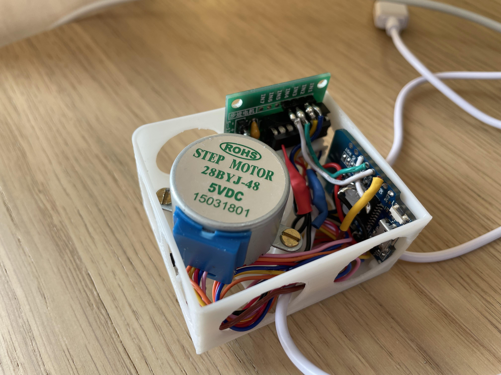
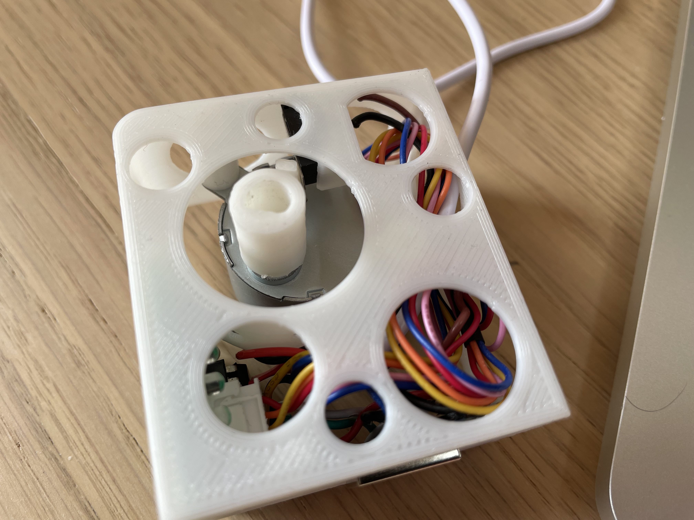
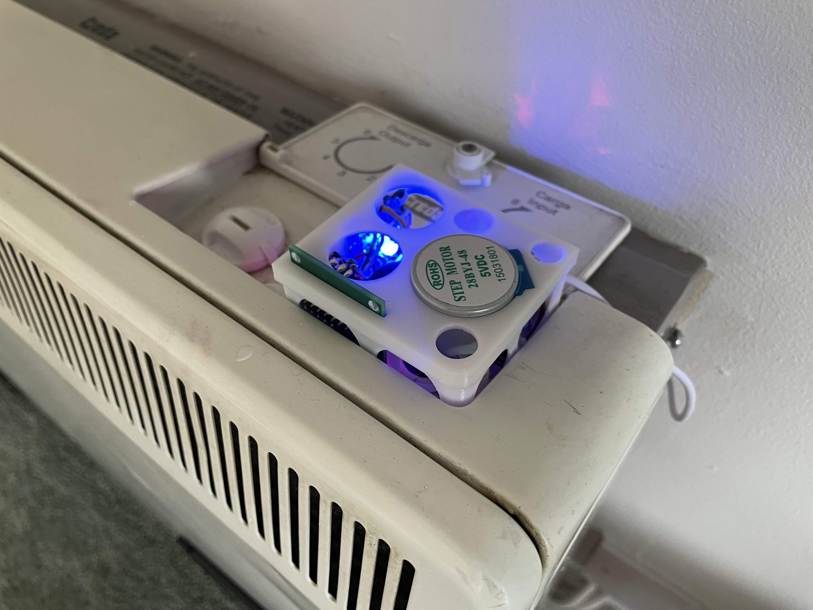
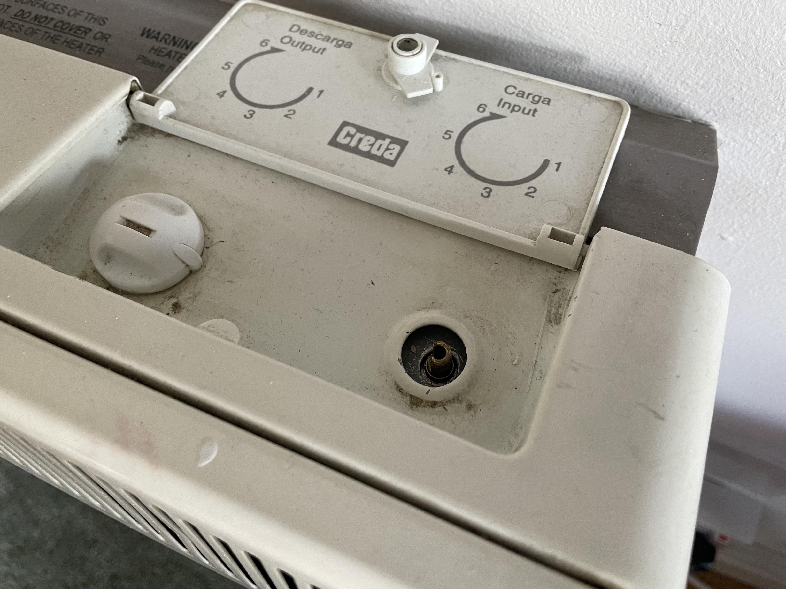
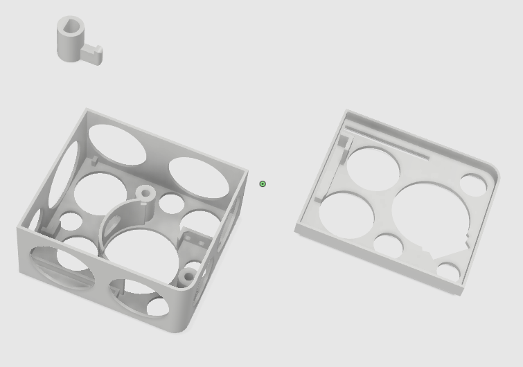
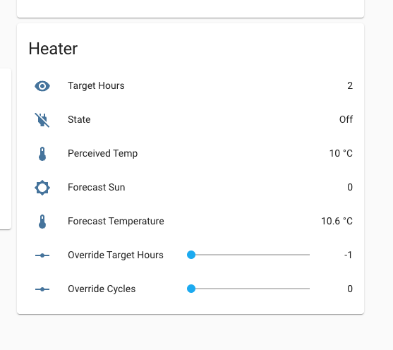
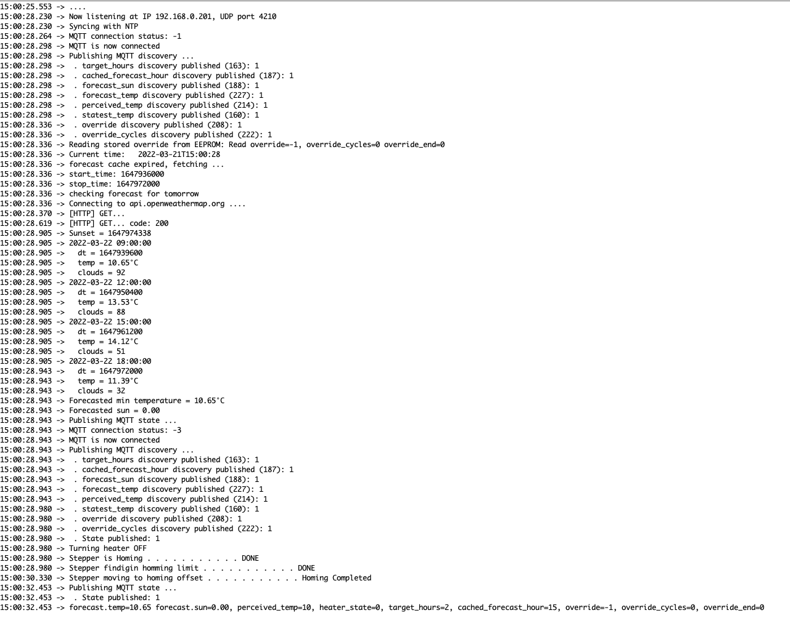

# Smart Storage Heater

A stepper motor driven by an ESP8266 MCU to control the input load from old-style night saver storage heater, based on weather forecast.

Storage heaters are quite common in Ireland and the UK. They typically run during night hours when electricity is cheaper, storing heat on massive stones and releasing it during the day.

Such a system has a couple of disadvantages mitigated by this project:
1. One needs to anticipate weather conditions for next day in order to set the input load to an appropriate level.
2. Heater usually powers on at 11PM (when night saver shift starts), releasing wasted heat during the entire night, when everyone is asleep.


## Features

- OpenWeatherMap integration: uses temperature and sun forecast to determine the right input load for each night
- MQTT integration with Homeassistant
    - Alternative UDP protocol for status and override actions
- Optionally dismiss weather forecast and override the amount of hours powered on during the night (EEPROM persisted)
- RGB LED to indicate state:
    - Heater on: light blinking
    - Heater off: light solid
    - Override enabled: white light
    - No load input scheduled: green light
    - Low to moderate load input scheduled: blue light
    - Moderate to high load input scheduled: purple light
    - Error: red light


## BOM
- [28BYJ-48 stepper motor and stepper controller board](https://www.amazon.co.uk/HUABAN-28BYJ-48-Stepper-ULN2003-Driver/dp/B08B4J33HX)
- [NodeMcu Mini wireless D1 ESP8266 ESP-12F](https://www.amazon.co.uk/gp/product/B08QZ2887K)
- [Limit Switch, SPDT NO+NC Hinge Lever](https://www.amazon.co.uk/gp/product/B07YDFH7H3)
- [RGB LED diode Common Cathode](https://www.amazon.co.uk/Gaoominy-Common-Cathode-Emitting-Diodes/dp/B07R1HN9JW)
- USB cable


## Usage

```bash
nc -u 192.168.0.201 4210

mosquitto_sub -h 192.168.0.10 -p 1883 -t "homeassistant/#" -u $MQTT_USER -P $MQTT_PWD
mosquitto_sub -h 192.168.0.10 -p 1883 -t "home/#" -u $MQTT_USER -P $MQTT_PWD
```

## Pictures
<p align="center">
    <br>
    
    <br>
    
    <br>
    
    <br>
    
    <br>
    
    <br>
    
    <br>
    
</p>


## License
```
           DO WHAT THE FUCK YOU WANT TO PUBLIC LICENSE
                   Version 2, December 2004
 
Copyright (C) 2022 Marc Aymerich

Everyone is permitted to copy and distribute verbatim or modified
copies of this license document, and changing it is allowed as long
as the name is changed.
 
           DO WHAT THE FUCK YOU WANT TO PUBLIC LICENSE
  TERMS AND CONDITIONS FOR COPYING, DISTRIBUTION AND MODIFICATION

 0. You just DO WHAT THE FUCK YOU WANT TO.
```